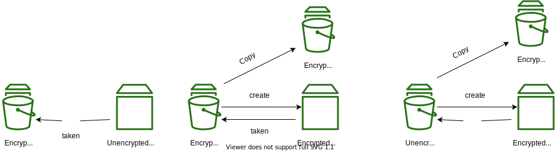

# EBS


Reference

[https://docs.aws.amazon.com/AWSEC2/latest/UserGuide/Storage.html](https://docs.aws.amazon.com/AWSEC2/latest/UserGuide/Storage.html)

#### Snapshots Encryption



## IOPS and Disk Throughput

AWS measures storage performance in *input/output operations per second*.

MySQL and MariaDB have a page size of 16 KB. Hence, writing 16 KB of data to disk would constitute one I/O operation.
Suppose your MySQL database needs to read 102,400 KB (100 MB) of data every second. Then the database needs to be able to read `102400 / 16 = 6400` 16 KB data, which requires your storage to be able to sustain 6400 IOPS.

Next consideration is the disk throughput - the data transfer rate.

Suppose you are running a MySQL, to sustain 2,000 Mbsp of disk throughput you need to divide the bandwidth by the page size, as follows:

```ruby
16 KB * 8 = 128 Kb
128 Kb = 0.128 Mb
2,000 Mbsp / 0.128 Mb = 15,625 IOPS
```

### General SSD Storage (gp2)

For each gigabyte of data that you allocate to a volume, RDS allocates that volume a baseline performance of three IOPS, up to a total of 16,000 IOPS per volume. 

A 20 GB volume would get 60 IOPS, whereas a 100 GB volume would get 300 IOPS. A 5,334 GB volume would get 16,000 IOPS. This means that the larger your volume, the better performance you’ll get. Thus the ratio of storage in gigabytes to IOPS is `3:1`.

To achieve 2,000 Mbps disk throughput to a volume, it would need 16,000 IOPS allo- cated. Note that you must specify provisioned IOPS in increments of 1,000. Also, as stated earlier, this is the maximum number of IOPS possible with gp2. To achieve this many IOPS, your volume would have to be 5,334 GB or about 5.33 TB.

### Provisioned IOPS SSD (io1)

The ratio of storage in gigabytes to IOPS must be at least `50:1`. For example, if you want 32,000 IOPS, you must provision at least 640 GB of storage.

You can provision up to 64,000 IOPS per io1 volume.
