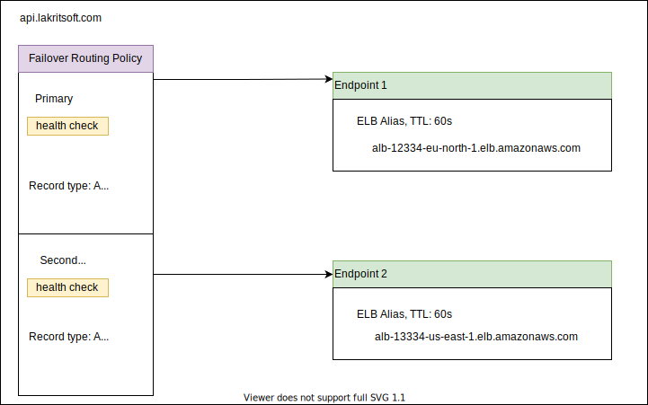
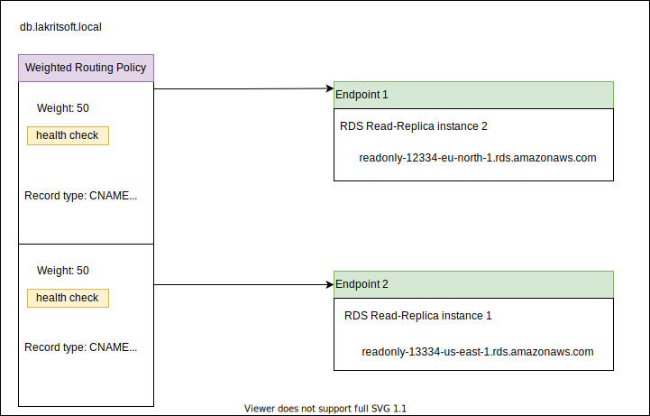

# Route 53

You can use Route 53 [failover routing](https://docs.aws.amazon.com/Route53/latest/DeveloperGuide/routing-policy.html#routing-policy-failover) policy to route traffic to the secondary cluster deployed in another region in case outage of the primary cluster. Note that `Simple Routing Policy` does not support health-checks.

As Elastic Load Blancer does not support RDS instances, you can, however, use Route 53 [weighted routing](https://docs.aws.amazon.com/Route53/latest/DeveloperGuide/routing-policy.html#routing-policy-weighted) policy to distribute traffic across the RDS Read Replicas. In case of a Read Replica health-check failure, Route 53 weighted record will exlcude those adresses in its reponse to a DNS query.

## Routing Policies

`GeoProximity Routing` lets Amazon Route 53 route traffic to your resources based on the geographic location of your users and your resources. You can also optionally choose to route more traffic or less to a given resource by specifying a value, known as a bias. A bias expands or shrinks the size of the geographic region from which traffic is routed to a resource.

# Blue/Green Deployment

You can use weighted routing for blue/green deployement. Read more at [Whitepaper: AWS Blue Green Deployment](https://d1.awsstatic.com/whitepapers/AWS_Blue_Green_Deployments.pdf)

Reference

- [Scale RDS instances](https://aws.amazon.com/blogs/database/scaling-your-amazon-rds-instance-vertically-and-horizontally/)
- [Distribute requests to RDS read replicas](https://aws.amazon.com/premiumsupport/knowledge-center/requests-rds-read-replicas/)

Note that [a reader endpoint for an Aurora DB cluster provides load-balancing support for read-only connections to the DB cluster.](https://docs.aws.amazon.com/AmazonRDS/latest/AuroraUserGuide/Aurora.Overview.Endpoints.html)

Read more

- [Routing internet traffic to AWS resources using Route 53](https://docs.aws.amazon.com/Route53/latest/DeveloperGuide/routing-to-aws-resources.html)
- [Cross-Region DNS-Based Load Balancing and Failover](https://docs.aws.amazon.com/whitepapers/latest/real-time-communication-on-aws/cross-region-dns-based-load-balancing-and-failover.html)

