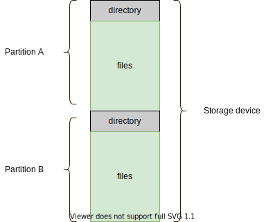

## Volume

Files are stored on random-access storage devices, including hard disks, solid-state disks.

Files can only be stored on a storage device with a file system created. Any entity containing a file system is generally known as a volume.

The volume may be partition or a whole device. Each volume that contains a file system must also contain information about the files in the system. This information is kept in entries in a **device directory** that records informtation -- such as name, location, size, and type -- for all files on that volume.




### Volume Mounting

Just as a file must be opened before it is used, a file system (volume) must be mounted beforeit can be availble on the operating system.

The mount procedure is straightforward. The operating system is given the name of the device and the **mount point** -- where the file system is to be attached.


#### Example (AWS EBS volume)

When we launch an AWS EC2 instance, we can add additional storage, by attaching additional [EBS volumes](https://docs.aws.amazon.com/AWSEC2/latest/UserGuide/ebs-volumes.html).


| Volume Type | Device    | Snapshot               | Size(GiB) | Volume Type |
| ---         | ---       | ---                    | ---       | ---         |
| Root        | /dev/xvda | snap-0ee8a4a337cf9d029 | 128       | SSD         |
| EBS         | /dev/xvdb |                        | 8         | SSD         |

The EBS storage attached to the EC2 instance is not ready to be used since it doesn't contain a file system. We therefore need to create a file system on this storage device and mount it onto the EC2 instance OS.

We could *ssh* into the launched EC2 instance and issue the commands below, in order to store files into this EBS volume.

```bash
$ lsblk
NAME     MAJ:MIN RM  SIZE RO  TYPE MOUNTPOINT
xvda     202:0    0  128G  0  disk
|_xvda1  202:1    0  128G  0  part /
xvdb     202:16   0    8G  0  disk
$ sudo su
$ file -s /dev/xvdb
/dev/xcdb: data
$ mkfs -t xfs /dev/xvdb
meta-data=/dev/xvdb   isize=512 agcount=4 agsize=524288 blks
.....
$ file -s /dev/xvdb
/dev/xvdb: SGI XFS filesystem data (blks 4096, inosz 512, v2 dirs)
$ makedir /data
$ mount /dev/xvdb /data
$ cd /data
$ touch test.txt
```

#### Example (Install Void Linux)

When installing [Void Linux](https://docs.voidlinux.org/installation/live-images/guide.html), the essential parts are to partition the computer disk and create file systems. 

Suppose the device name for the computer disk is `/dev/sda` and we need to partition the disk and create the file system for each partition as:

<style>
table {
  margin: 0!important;
}
</style>

| Device    | Size | Type             | Mount point | File system type     |
| :---      | :--- | :---             | :---        | :---                 |
| /dev/sda1 | 100M | BIOS boot        | /boot/efi   | vfat  FAT32          |
| /dev/sda2 | 298G | Linux filesystem | /           | btrfs Oracle's Btrfs |
